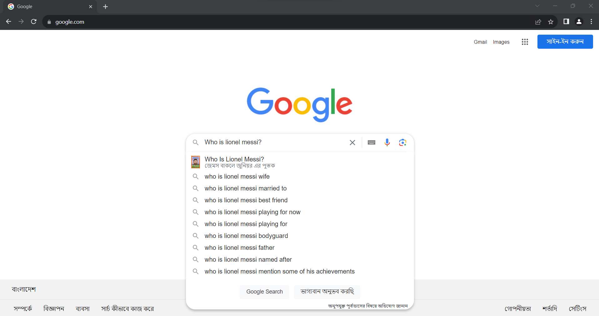

# Python Selenium Starter Template

This is a starter template for Python Selenium WebDriver. It includes a Selenium wrapper for common automation tasks.

## Getting Started

1. Clone the repository or download it:
   ```bash
   git clone https://github.com/md-Salah/python-selenium-starter-template.git
   ```
2. Navigate to the folder & install dependency:

```bash
    cd python-selenium-starter-template
    pip install -r requirements.txt
```

3. Run the code:

```bash
    python main.py
```

## Example Usage

```python
from modules.selenium_wrapper import SeleniumWrapper

# Create a SeleniumWrapper instance
spider = SeleniumWrapper()

# Set up the Chrome driver (headless=False for GUI)
spider.setup_driver(headless=False)

# Navigate to Google and perform a search
spider.get_page('https://www.google.com/')
spider.element_send_keys(text='Who is Lionel Messi?',
                         selector='textarea[name="q"]'
                         )

```

#### Screenshot




## Credits

1. [Md Towfikul Islam](https://github.com/towfikul-islam/)
2. [Mohammad Salah Uddin](https://github.com/md-Salah)
